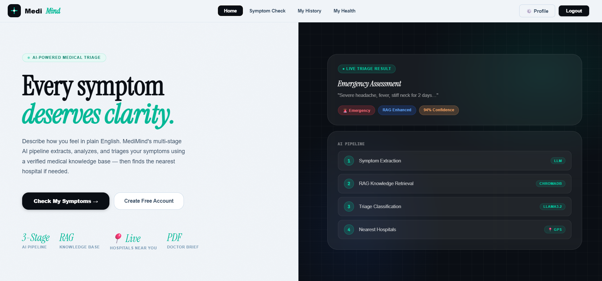
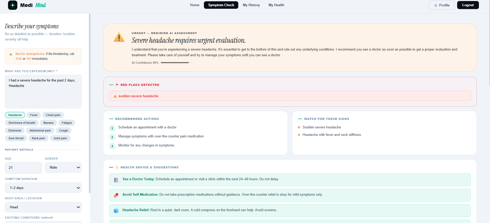
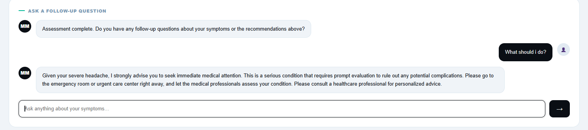
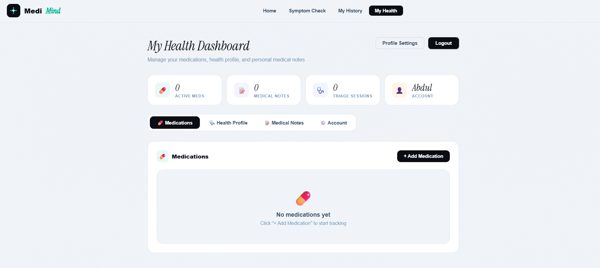
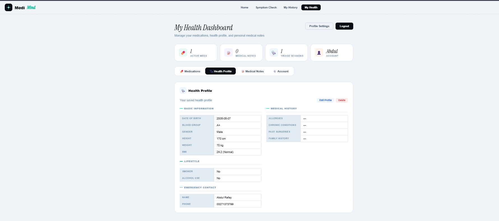
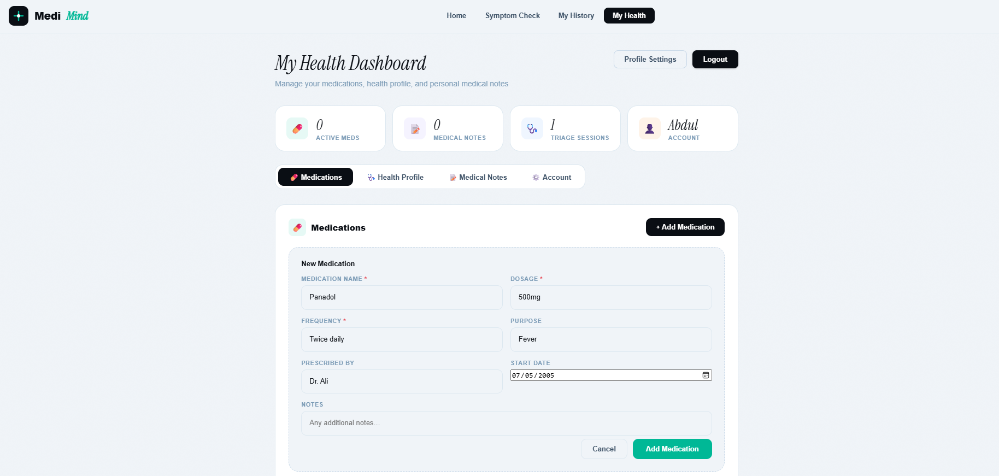
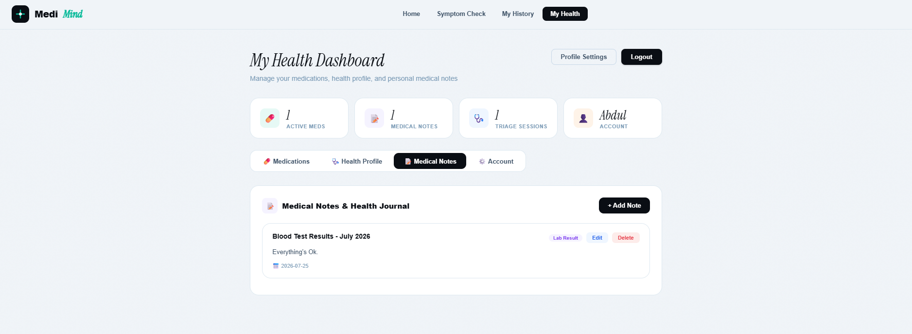
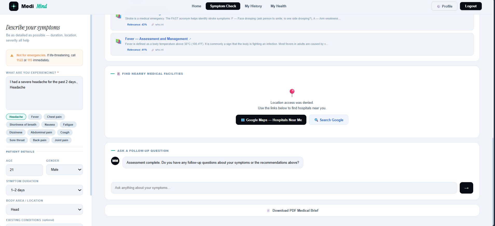
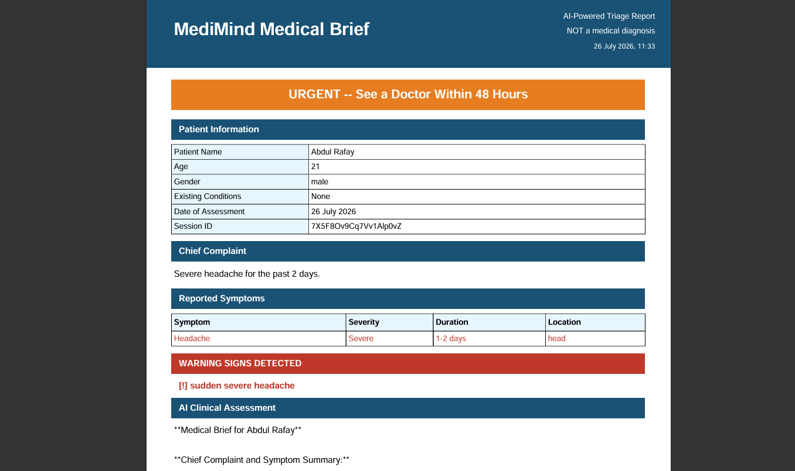

# 🧠 MediMind — AI-Powered Medical Triage Assistant

> Describe your symptoms in plain English. Get an instant, evidence-grounded
> triage assessment — EMERGENCY, URGENT, or SELF-CARE — plus a plan of action,
> in seconds, for free.

## a. What it does, and who it's for

Access to a doctor for a quick "is this serious?" question is slow, expensive,
or simply unavailable for a lot of people — students living away from home,
people in areas with few clinics, or anyone at 2 AM trying to decide whether
a symptom can wait until morning or needs an ER visit right now.

**MediMind** is a health-triage web app that takes a free-text description of
symptoms and, in one pipeline call:
1. Extracts a structured symptom profile (chief complaint, individual
   symptoms, severity, duration, red flags) from the raw text.
2. Retrieves relevant grounding passages from a curated medical knowledge base
   using RAG (Retrieval-Augmented Generation), so the model isn't reasoning
   from memory alone.
3. Classifies the case into one of three triage levels and returns concrete,
   actionable next steps, warning signs to watch for, and an empathetic
   explanation in plain language.

It is built for anyone who wants a fast, structured first read on their
symptoms before deciding whether to see a doctor — **it is explicitly not a
diagnostic tool** and says so throughout (see Safety & Ethics below).

## b. Live URL

| | |
|---|---|
| **App (frontend)** | https://medimind-abdul-rafay19.vercel.app |
| **API (backend)**  | https://abdul-rafay19-medimind.up.railway.app |
| **API docs**        | https://abdul-rafay19-medimind.up.railway.app/docs |

> First request after idle time may take a little longer while the free
> backend tier wakes back up — this is expected, not a bug.

## c. Features

**Core AI triage**
- Free-text symptom input → structured extraction + RAG retrieval + triage classification in a single pipeline
- 3-level triage output: 🔴 EMERGENCY / 🟡 URGENT / 🟢 SELF-CARE, with a confidence score
- Concrete recommended actions and warning signs to watch for
- Guest mode (try it without an account) and logged-in mode (saves your history)
- Multi-turn follow-up Q&A on a completed triage session, with the original context retained
- Downloadable PDF medical brief you can bring to a doctor
- Nearby medical facilities lookup

**Accounts & data**
- Email/password registration and login (JWT-based sessions)
- "Continue with Google" sign-in via Firebase Auth
- Forgot-password flow with a verification code
- Full triage history, viewable and deletable per session
- Personal health profile (blood group, allergies, chronic conditions, emergency contact, lifestyle factors)
- Medication tracker — full create/read/update/delete for ongoing and past medications
- Personal medical notes/journal — full CRUD

**Engineering**
- FastAPI backend, vanilla HTML/CSS/JS frontend (no framework overhead, fast to load)
- Firebase Firestore for triage sessions, medications, health profiles, and notes; SQLite for fast local auth lookups
- ChromaDB + sentence-transformers for the RAG vector store, auto-built from the JSON knowledge base on first boot
- Dockerized backend, deployable to any container host
- Health-check endpoint for uptime monitoring

## d. The AI feature — pipeline and prompts

MediMind's core AI feature is a **3-stage LLM pipeline** (implemented in
`backend/app/services/llm_service.py` and `rag_service.py`), run through
NVIDIA NIM's OpenAI-compatible free-tier endpoint with automatic fallback
across three models (`meta/llama-3.1-8b-instruct` →
`mistralai/mistral-7b-instruct-v0.3` → `microsoft/phi-3-mini-4k-instruct`) so
a single provider hiccup doesn't take the feature down.

**Stage 1 — RAG retrieval.** The raw symptom text is embedded
(`all-MiniLM-L6-v2`) and matched against a ChromaDB vector store built from a
curated medical knowledge base (`backend/data/knowledge_base/medical_conditions.json`),
returning the top-5 most relevant reference passages.

**Stage 2 — Combined extraction + triage classification.** This is the
system prompt that does the actual clinical-style reasoning (written for
this project, not copied from a template):

```
You are a medical triage AI. Analyze the patient input and return ONE JSON object.

PATIENT: "{symptoms}"
AGE: {age}
GENDER: {gender}
CONDITIONS: {existing_conditions}

MEDICAL REFERENCES:
{top-5 RAG passages, with source attribution}

TRIAGE LEVELS:
- EMERGENCY: life-threatening, call emergency services NOW
- URGENT: serious, see a doctor within 24-48 hours
- SELF_CARE: mild, manage at home

SAFETY RULE: If ANY red flag present → EMERGENCY. Red flags: chest pain,
difficulty breathing, sudden severe headache, loss of consciousness, stroke
symptoms, uncontrolled bleeding, high fever + stiff neck, severe allergic
reaction.

Return ONLY this JSON, nothing else before or after:
{
  "chief_complaint": ..., "symptoms": [...], "duration_overall": ...,
  "severity_overall": ..., "red_flags": [...], "triage_level": ...,
  "triage_color": ..., "confidence": ..., "headline": ..., "reasoning": ...,
  "response": ..., "actions": [...], "warning_signs": [...]
}
```

Design choices baked into this prompt on purpose:
- A **hard-coded red-flag override rule** so the model can't reason its way
  out of an emergency classification for genuinely dangerous symptom
  combinations — the safety floor isn't left entirely to model judgment.
- **Temperature 0.1** everywhere for consistency — this isn't a creative task.
- The RAG passages are injected with their source labeled, so the model's
  reasoning is grounded in and attributable to actual reference material.

**Stage 3 — Follow-up Q&A and report generation** use two smaller, separate
prompts (also in `llm_service.py`) that explicitly forbid diagnosing or
naming specific medications, and always close with a prompt to consult a
real healthcare professional.

## e. Tools, services, and models used

| Layer | Choice |
|---|---|
| LLM inference | NVIDIA NIM (free tier), OpenAI-compatible API — `meta/llama-3.1-8b-instruct` primary, with `mistral-7b-instruct` and `phi-3-mini` as automatic fallbacks |
| RAG / vector store | ChromaDB (persistent) + `sentence-transformers` (`all-MiniLM-L6-v2`) |
| Backend framework | FastAPI (Python 3.11), async SQLAlchemy |
| Auth | Custom JWT (python-jose + passlib/bcrypt) + Firebase Auth for Google sign-in |
| Database | Firebase Firestore (triage sessions, medications, health profiles, notes) + SQLite (user accounts only) |
| PDF generation | fpdf2 |
| Frontend | Plain HTML/CSS/JavaScript (no framework) |
| Containerization | Docker |
| Hosting | Railway (backend, Docker web service, persistent volume for SQLite) + Vercel (static frontend) |

## f. Screenshots

Screenshots of the live app in action:

**Home dashboard**


**Symptom check — entering symptoms**


**AI-extracted symptoms and medical references (RAG grounding)**


**Follow-up questions on a completed triage session**


**Health dashboard overview**


**Health profile**


**Medications tracker**


**Medical notes**


**Nearby medical facilities**


**Downloadable PDF medical brief**


## g. How to run it locally

### Prerequisites
- Python 3.11+
- A free NVIDIA NIM API key: https://build.nvidia.com (click any model → "Get API Key")
- A Firebase project with Firestore enabled, and a service account key: Firebase Console → Project Settings → Service Accounts → Generate New Private Key

### 1. Clone

```bash
git clone https://github.com/YOUR_USERNAME/medimind.git
cd medimind
```

### 2. Backend

```bash
cd backend
python -m venv venv
source venv/bin/activate        # Windows: venv\Scripts\activate

pip install -r requirements.txt

cp .env.example .env
# Edit .env: paste your OPENROUTER_API_KEY (starts with nvapi-)
# Save your Firebase service account file as backend/serviceAccountKey.json

uvicorn app.main:app --reload --port 8000
```

Backend is now running at `http://127.0.0.1:8000` — check `http://127.0.0.1:8000/docs`.

### 3. Frontend

```bash
cd frontend
python -m http.server 3000
```

Open `http://localhost:3000`. It auto-detects localhost and points at your
local backend — no config needed for local dev.

### 4. Or, run everything with Docker

```bash
cp backend/.env.example backend/.env
# edit backend/.env with your real keys, as above
docker-compose up --build
```

- Frontend: http://localhost:3000
- Backend: http://localhost:8000
- API docs: http://localhost:8000/docs

**Full deployment instructions** (Railway + Vercel, to get a public live URL)
are in [`DEPLOYMENT.md`](./DEPLOYMENT.md).

---

## Safety & Ethics

- Every response carries a clear disclaimer — MediMind **informs and
  triages, it never diagnoses**.
- A hard-coded red-flag rule forces an EMERGENCY classification for known
  dangerous symptom combinations, regardless of what the model would
  otherwise conclude.
- Follow-up answers and generated reports are explicitly instructed never to
  name specific medications or state a diagnosis.
- Low temperature (0.1) throughout for consistency in a medical-adjacent
  context.
- This is a course/portfolio project, not a certified medical device — real
  medical decisions should always involve a real clinician.

## Project structure

```
medimind/
├── backend/
│   ├── app/
│   │   ├── main.py                # FastAPI entry point
│   │   ├── api/                   # auth, triage, history, reports, crud, health
│   │   ├── core/                  # config, db, firebase, security
│   │   ├── models/                # SQLAlchemy models + Pydantic schemas
│   │   └── services/               # llm_service, rag_service, report_service
│   ├── data/knowledge_base/        # medical knowledge JSON (RAG source)
│   ├── requirements.txt
│   ├── Dockerfile
│   └── .env.example
├── frontend/
│   ├── index.html
│   ├── css/
│   └── js/
├── screenshots/                    # app screenshots referenced above
├── render.yaml                     # optional Render deployment blueprint (live deploy uses Railway)
├── docker-compose.yml
├── DEPLOYMENT.md
└── README.md
```

---

*Built as an individual final project. Every feature listed above is
implemented and working end to end — see DEPLOYMENT.md for how it's
deployed, and the live URL above to try it yourself.*
